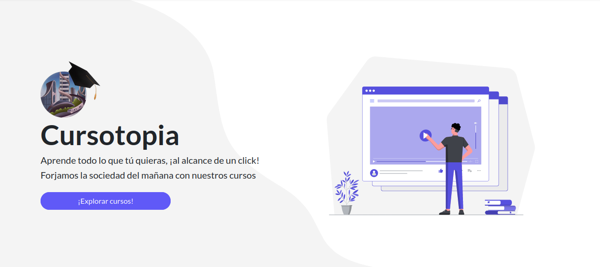
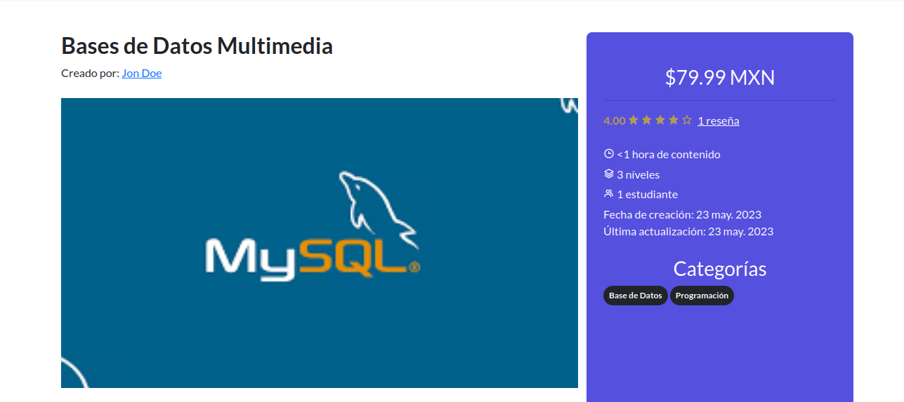

# Cursotopia

Cursotopia is a web application for online courses



# Technologies:
## Frontend
<p align="left">


</p>

## Backend
<p align="left">


</p>

## Others
<p align="left">

</p>

#


# Setup

Clone the repository
```
git clone https://github.com/Prz-Ellam/Cursotopia
cd Cursotopia
```

Initialize the dependencies for frontend and backend
```
npm install
```

```
composer update --no-dev
```

Transpile the frontend code into a dist for the web
```
npm run build
```

This will generate a `dist` folder in `public`

If you use Apache, set the public folder of the project in the `httpd.conf`
```
DocumentRoot <This is where your public folder path goes>

<Directory "<This is where your public folder path>">
    Options Indexes FollowSymLinks
    AllowOverride All
    Require all granted
    Allow from all
</Directory>
```

Change configuration in the php.ini to support video upload
```
php_value upload_max_filesize 500M
php_value post_max_size 500M
php_value max.execution_time 300
```

Enable Intl module in php.ini
```
extension=intl
```

Go to the folder `/database` and execute php script
```
php build.php
```

This is gonna create a `cursotopia.sql`, in your RDBMS execute the script and this will create the entire cursotopia.sql (tables, stored procedures, triggers, views, functions and initial data)

Create a `.env` file in the root folder (you can duplicate the `.env.example` and rename it)
Fill it with your database

Recomended values:
```
APP_NAME=Cursotopia
APP_DEBUG=false
APP_TIMEZONE=Etc/GMT-6
APP_LANG=es-MX
APP_LOCALE=es_MX.UTF-8
APP_CHARSET=UTF-8
```

# Features
- [x] Auth
- [x] Users and roles
- [x] Courses
- [x] Levels (Sections)
- [x] Categories
- [x] Messages
- [x] Comments and reviews
- [x] Homepage
- [x] Certificates and progress
- [x] Sales reports
- [x] Browser
